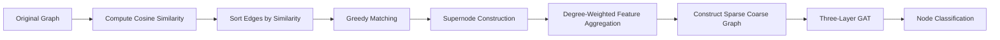

# Feature-Preserving Graph Coarsening for Node Classification using Graph Attention Networks

<p align="center">


</p>

---

## Overview

Graph Neural Networks (GNNs) have become the standard approach for learning over graph-structured data. However, their computational cost grows rapidly with graph size, making attention-based architectures such as **Graph Attention Networks (GATs)** expensive for large-scale datasets.

This project proposes a **feature-preserving graph coarsening pipeline** that compresses the graph **before** GAT training. Instead of learning dense assignment matrices, the method performs **static, single-pass greedy matching** based on cosine similarity, constructs a sparse coarse graph, and trains a three-layer GAT on the compressed representation.

The objective is to reduce computation while preserving the structural and semantic information required for node classification.

---

## Key Features

- Feature-aware graph coarsening
- Cosine similarity based edge affinity
- Static greedy edge matching
- Sparse supernode construction
- Degree-weighted feature aggregation
- Majority-vote coarse labels
- Pure-cluster supervised learning
- Three-layer Graph Attention Network
- Residual GAT architecture
- Compactness loss for feature preservation
- AdamW optimizer
- Cosine Annealing Learning Rate Scheduler

---

# Methodology



---

# Algorithm

## Step 1 — Edge Affinity

Cosine similarity is computed **only on existing graph edges**

\[
s(u,v)=
\frac{x_u^Tx_v}
{\|x_u\|\|x_v\|}
\]

Cosine similarity is preferred over Euclidean distance because the Cora dataset contains sparse bag-of-words features where vector direction is more informative than magnitude.

---

## Step 2 — Static Greedy Matching

All graph edges are sorted in descending similarity.

The algorithm repeatedly selects the highest-scoring edge whose endpoints are still unmatched.

After a pair is merged

- both nodes are permanently marked as matched
- all remaining incident edges are skipped
- unmatched nodes become singleton clusters

### Design Choice

Unlike hierarchical clustering,

**cosine similarities are never recomputed after merging.**

Recomputing similarities after every merge would transform the algorithm into an iterative agglomerative clustering algorithm with significantly higher computational complexity.

Instead, this implementation performs **single-pass greedy matching**, resulting in an efficient preprocessing stage with approximately

\[
O(|E|\log|E|)
\]

time complexity.

---

# Feature Aggregation

Each supernode feature is computed using **degree-weighted averaging**

\[
x_r^c
=
\frac{
\sum_{i\in C_r}(d_i+1)x_i
}{
\sum_{i\in C_r}(d_i+1)
}
\]

Higher-degree nodes usually capture more structural information.

Using degree weighting allows structurally important nodes to contribute more strongly than simple averaging while ensuring isolated nodes remain influential through the \(+1\) offset.

---

# Coarse Graph Construction

After clustering,

the coarse graph is built by

- aggregating node features
- constructing coarse adjacency
- assigning one label per supernode

Coarse adjacency is obtained by

\[
A_c=M^TAM
\]

followed by removing duplicate edges and self-loops.

Coarse labels are assigned using **majority voting**

\[
y_r^c
=
mode(y_i)
\]

which provides deterministic and computationally inexpensive supervision.

---

# Pure-Cluster Supervision

Not every supernode is suitable for supervised learning.

Some merged clusters contain nodes belonging to **different classes**.

Training on such clusters would assign one label to multiple semantic classes, introducing **label ambiguity** and contradictory supervision.

Therefore,

only **pure clusters**

- whose member nodes all belong to the same class
- and originate from the same original data split

are used for

- training
- validation
- testing

### Important

Mixed-label clusters are **not discarded**.

They remain in the coarse graph and continue participating during GAT message passing.

They are excluded **only from the supervised classification loss**, preserving label consistency while retaining structural information.

---

# Three-Layer GAT Architecture

```
Input Features
        │
        ▼
GAT Layer 1
(8 Attention Heads)
        │
        ▼
GAT Layer 2
(Higher-order Context)
        │
Residual Connection
        │
        ▼
Dropout
        │
        ▼
GAT Layer 3
(Classification)
```

### Layer 1

Extracts complementary local neighborhood features.

### Layer 2

Captures broader graph context after coarsening.

### Residual Connection

Preserves low-level representations and stabilizes gradient flow.

### Layer 3

Produces final logits for node classification.

---

# Training Objective

The overall loss is

\[
L
=
L_{cls}
+
0.01L_{feature}
\]

where

### Cross Entropy Loss

Optimizes node classification.

Label smoothing improves generalization on the smaller coarse graph.

### Compactness Loss

Measures how well coarse features reconstruct the original node features.

This acts as a feature-preservation diagnostic.

---

# Optimization

| Component | Configuration |
|------------|---------------|
| Optimizer | AdamW |
| Learning Rate | 1e-3 |
| Scheduler | Cosine Annealing |
| Epochs | 500 |
| Label Smoothing | 0.15 |
| Residual Connection | Yes |
| Batch Normalization | Yes |
| Dropout | 0.6 |

---

# Dataset

| Property | Value |
|-----------|------:|
| Dataset | Cora |
| Nodes | 2708 |
| Edges | 10556 |
| Features | 1433 |
| Classes | 7 |

---

# Experimental Results

| Metric | Result |
|---------|-------:|
| Original Nodes | 2708 |
| Coarse Nodes | 1667 |
| Node Reduction | 38.44% |
| Edge Reduction | 33.82% |
| Runtime | 55 s |
| Best Validation Accuracy | 87.23% |
| Best Test Accuracy | 92.47% |

---

# Running the Notebook

Open the notebook directly in Google Colab.

```bash
git clone <repository-url>

cd <repository-name>
```

Open

```
Graph_Coarsening_Pipeline.ipynb
```

Enable

```
Runtime → Change Runtime Type → GPU
```

Run all notebook cells sequentially.

The notebook performs

- graph coarsening
- coarse graph construction
- GAT training
- evaluation

automatically.

---

# Future Work

- Differentiable assignment matrices
- End-to-end trainable graph coarsening
- Evaluation on Citeseer, PubMed and OGB datasets
- Hierarchical multi-level graph coarsening
- Memory and runtime benchmarking
- Original-node prediction transfer

---

# References

- Veličković et al., **Graph Attention Networks**, ICLR 2018.
- Ying et al., **DiffPool**, NeurIPS 2018.
- Dhillon et al., **Weighted Graph Cuts without Eigenvectors**, TPAMI 2007.
- Loukas, **Graph Reduction with Spectral and Cut Guarantees**, JMLR 2019.

---

# Citation

```bibtex
@misc{pant2026graphcoarsening,
  title={Feature-Preserving Graph Coarsening for Node Classification using Graph Attention Networks},
  author={Nityansh Pant},
  year={2026},
  note={Summer Research Internship, RGIPT}
}
```

---

# License

This project is released under the **MIT License**.

---

## Acknowledgements

- Rajiv Gandhi Institute of Petroleum Technology (RGIPT)
- Prof. Preety Singh
- PyTorch
- PyTorch Geometric
- Planetoid (Cora) Dataset
- Graph Attention Networks (GAT)

---

⭐ If you find this repository useful, consider starring it.
